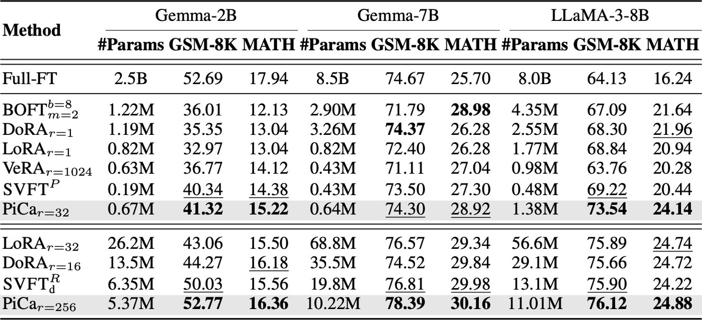

# PiCa: Parameter-Efficient Fine-Tuning with Column Space Projection

<p align="center">
  <a href="https://arxiv.org/abs/2505.20211"></a>
  <a href="https://openreview.net/"></a>
  
  
</p>

<p align="center">
Parameter-efficient fine-tuning via <b>column space gradient projection</b> and <b>shared adapters</b>.
</p>

**Official implementation of [PiCa: Parameter-Efficient Fine-Tuning with Column Space Projection](https://arxiv.org/abs/2505.20211) (ICLR 2026).**

---

# Overview

**PiCa (Parameter-Efficient Fine-tuning with Column Space Projection)** is a theoretically grounded PEFT method that leverages the intrinsic geometry of pre-trained weights for effective and extremely parameter-efficient adaptation.

Our analysis shows that projecting gradients onto the **principal column space** spanned by pre-trained weights leads to efficient adaptation. This projection is paired with a **weight-sharing mechanism** that further reduces the number of trainable parameters.

As a result, **PiCa significantly outperforms LoRA, DoRA, and other PEFT baselines — even with fewer trainable parameters than rank-1 configurations.**

<p align="center">
  
</p>

<p align="center">
<b>Figure 1.</b> PiCa achieves higher accuracy with fewer trainable parameters than existing PEFT methods.
</p>

**Key properties of PiCa**

- Gradient projection onto the **principal column space**
- **Shared trainable matrices** across layers
- **Higher accuracy with fewer parameters** than LoRA-style adapters

---

# Results

<p align="center">
  
</p>

<p align="center">
<b>Figure 2.</b> PiCa outperforms competing PEFT methods on mathematical reasoning benchmarks (GSM8K, MATH).
</p>

---

# Method

Given a frozen pre-trained weight matrix **W₀** ∈ ℝ<sup>d_in×d_out</sup> and an input **X**, PiCa computes:

> **Y = X (W₀ + U<sub>r</sub> M)**

where:

- **U<sub>r</sub>** ∈ ℝ<sup>d_in×r</sup> — top-*r* left singular vectors of **W₀** (frozen; computed via SVD)
- **M** ∈ ℝ<sup>r×d_out</sup> — the **only trainable parameter**, shared across layers of the same type

This design means the effective number of trainable parameters is `r × d_out` per module group (not per layer), making PiCa significantly more parameter-efficient than LoRA.

### Comparison with LoRA

| Feature | LoRA | PiCa |
|---|---|---|
| Trainable params | L × (d_in × r + r × d_out) | L × (r × d_out) (shared M) |
| Grounded projection | ❌ random init | ✅ principal column space |
| Weight sharing | ❌ | ✅ across same-type layers |
| Memory footprint per layer | d_in × r + r × d_out | r × d_out only |

---

# Installation

```bash
git clone https://github.com/hjunseoh/PiCa.git
cd PiCa

conda create -n pica python=3.10 -y
conda activate pica

pip install -e .
```

> **Requirements**: Python ≥ 3.10, PyTorch ≥ 2.0, Transformers ≥ 4.30

---

## Quick Start

### Training

```python
from transformers import AutoModelForCausalLM, AutoTokenizer
from pica import get_pica_model

# 1. Load base model
model = AutoModelForCausalLM.from_pretrained("google/gemma-2b")

# 2. Apply PiCa — only shared_m matrices are trainable
model = get_pica_model(
    model,
    target_modules=["q_proj", "k_proj", "v_proj", "up_proj", "down_proj"],
    rank=256,
    base_model_name_or_path="google/gemma-2b",  # stored in config for later
)

# 3. Train with any standard trainer ...

# 4. Save adapter only (~KB, not GB)
model.save_adapter("./pica_adapter")
```

### Inference

```python
from transformers import AutoModelForCausalLM
from pica import load_pica_model

# Load base model + reconstruct adapter (P recomputed via SVD on-the-fly)
base_model = AutoModelForCausalLM.from_pretrained("google/gemma-2b")
model = load_pica_model(base_model, "./pica_adapter")

# (Option A) Keep adapter separate — call model() directly
output = model.generate(input_ids)

# (Option B) Fuse into a clean model for deployment
model = model.merge_and_unload()
```

---

## Reproducing Experiments

### Commonsense Reasoning (LLM-Adapters)

Evaluation datasets are pre-downloaded in `LLM-Adapters/ft-training_set/`.

```bash
cd LLM-Adapters
bash pica.sh     # train
bash eval.sh     # evaluate
```

### Mathematical Reasoning (MetaMathQA)

Dataset is pre-downloaded in `MetaMath/data/train/`.

```bash
cd MetaMath
bash pica.sh     # train on MetaMathQA-40K
bash eval.sh     # evaluate on GSM-8K and MATH
```

---

## Acknowledgement

This repository builds upon [SVFT](https://github.com/VijayLingam95/SVFT) and [LLM-Adapters](https://github.com/AGI-Edgerunners/LLM-Adapters). We thank the authors for their excellent open-source work.

---

## Citation

```bibtex
@inproceedings{hwang2026pica,
  title     = {PiCa: Parameter-Efficient Fine-Tuning with Column Space Projection},
  author    = {Junseo Hwang and Wonguk Cho and Taesup Kim},
  booktitle = {The Thirteenth International Conference on Learning Representations (ICLR)},
  year      = {2026},
  url       = {https://arxiv.org/abs/2505.20211}
}
```
